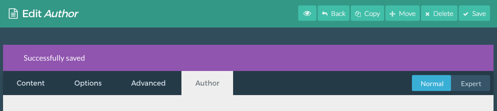

As an example of some of the methods outlined previously in this chapter, we will create a new page template which will add an about page to our example site.

We want our About page to have the following accessible fields in the Grav admin:

* Profile Photo
* Content Body (Text)
* Contact Information
  - Name
  - Email
  - Location (city/state/country)

The content body is available for editing by default to any new page. So for the purpose of this tutorial, we will focus on adding the profile photo and contact information fields so they are easily accessible via the Grav administrator.

### Step 1: Create a Custom Template

The first step to creating a custom template is to duplicate an existing template. This will save you the headache of having to start from scratch. You can do this by navigating to `ROOT/user/themes/themes/THEME_DIR/templates/`, finding the template you would like to base your new one on, and duplicating it in that folder. In our example, we used `item.html.twig` from the **Antimatter** theme.

Once you have done this, you will want to give it a unique name. We're going to name the file `author.html.twig` as it will be assigned exclusively to our author page.

!! Doing this can put you at risk of losing your file when you update your theme if you give your new template the same name as one being added by the update. As long as the file name is unique, this shouldn't be a problem.

### Step 2: Create a Template YAML File

Template YAML files tell Grav what fields to show in the Grav admin. These files are located in `ROOT/user/themes/THEME_DIR/blueprints`. Just as you did with the twig file before, find a YAML file you would like to use as a base for your new YAML file, duplicate it, and change its name. In this case, we took a file called `item.yaml` and saved its copy as `author.yaml` to match the name of our new template.

There are two things you will want to change right off the bat. Both `title` fields should be adjusted. Here is how the top part of the YAML file looked before we made our adjustment:

```yaml
title: Item
'@extends':
    type: default
    context: blueprints://pages

form:
  fields:
    tabs:

      fields:
        blog:
          type: tab
          title: Blog Item`
```

We changed the top `title` to `Author` to match the name of our new template, and the `title` field shortly below that which sets the name of the custom settings tab in the Grav administrator has also been changed to `Author`.

```yaml
title: Author
'@extends':
    type: default
    context: blueprints://pages

form:
  fields:
    tabs:

      fields:
        blog:
          type: tab
          title: Author
```

Once this is done, you should be able to see this new tab in your Grav administrator appear whenever you have assigned the **Author** template we just created to a page.



### Step 3: Set Up Your Twig

The next step involves setting up your new template's twig file to match the information you would like to have appear in your new page type.

To start, we borrowed code from `item.html.twig` that included information and formatting we wanted to have in our new page. Here is our code at this step:

```twig


    
    
    

  
    
      
    
    
    <div class="blog-content-item grid pure-g-r">
      <div id="item" class="block pure-u-2-3">
          
                    
                        
                    
                        
                    
                    {{ author_image_media.html }}
                
                    {{ author.name }}
                    {{ author.email }}
                    {{ author.location }}
                {{ page.content }}
      </div>
      <div id="sidebar" class="block size-1-3 pure-u-1-3">
        
      </div>
    </div>
  


```

This gives us a photo at the top of the page, and a basic output of the author's name, email, and location settings established in the fields in the page settings.

### Step 4: Set Up the YAML File

Now, we need to refine the YAML file for your new template so that it has all the fields you need. In this case, we want to have fields for the author's photo and contact information including: name, email address, and location.

```yaml
title: Author
'@extends':
    type: default
    context: blueprints://pages

form:
  fields:
    tabs:

      fields:
        blog:
          type: tab
          title: Author

          fields:

            author_image:
              type: section
              title: Author Image
              underline: true

            header.author.image:
              type: toggle
              toggleable: true
              label: Display Author Image
              help: Enabled displaying of an author image
              highlight: 1
              options:
                1: Enabled
                0: Disabled

            header.author.image_file:
              type: text
              toggleable: true
              label: Image File
              help: image filename that exists in the page folder. If not provided, will use the first image found.
              placeholder: For example: myimage.jpg

            author_information:
              type: section
              title: Author Information
              underline: true
            
            header.author.name:
              type: text
              label: Full Name

            header.author.email:
              type: text
              label: Email Address

            header.author.location:
              type: text
              label: Location
```

At this point, we have created a YAML file based on `item.yaml` called `author.yaml`, removed any fields that we did not need, and have inserted a new section called `Author Information`. Below that, we created three simple text fields: `author.name`, `author.email`, and `author.location`.

### Step 5: Styling

Now, we need to apply some styling to our page before we dive in to the advanced bits and pieces. We adjusted our `author.html.twig` file to add some styling classes which we set up in a separate `author.css` file located in the `ROOT/user/themes/THEME_DIR/css` directory.

Here is our refined twig file:

```twig


    
    
    
    
    
    

  
    
      
    
    
    <div class="grid pure-g-r">
      <div class="author-page block pure-u-2-3">
          <div class="author-avatar">
                    
                        
                            
                        
                            
                        
                        {{ author_image_media.cropResize(author_image_width, author_image_height).html }}
                    
                </div>
                <div class="author-details">
                    <h2>{{ author.name }}</h2>
                    <div><strong>Email:</strong> {{ author.email }}</div>
                    <div><strong>Location:</strong> {{ author.location }}</div>
                </div>
                <div class="author-bio">
                    {{ page.content }}
                </div>
      </div>
      <div id="sidebar" class="block size-1-3 pure-u-1-3">
        
      </div>
    </div>
  


```

You will probably notice above, we added image size constraints and some text styling around the author info.

Here is our new `author.css` file:

```css
.author-avatar{
    float: left;
    margin-right: 1rem;
}

.author-details{

}

.author-bio{
    clear: both;
}
```

This provides some very basic styling, and sets up our author information fields.

At this point you should have a properly styled, and accessible Author page for your Grav site.

